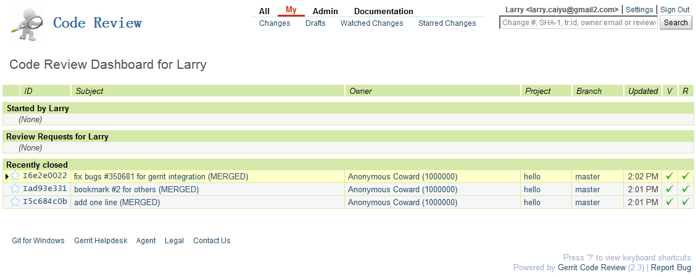

# gerrit-demo

This is the system setup for gerrit demo, mainly for windows, and it should work for other OS as well.

This repo will be cloned to gerrit besides guideline and some configuration data

# System setup in general
In order to demo, gerrit system needs to be installed and well configured in advance.

## Gerrit installation
1. Install [Git for Windows](http://msysgit.github.com) to have git environment
2. Install gerrit using development mode for authentication, others are use default to keep simple.

## Gerrit server configuration 
1. Integrate gitweb, see [blog:integrate gitweb with gerrit without apache server in windows](http://codeslife.com/2012/05/21/integrate-gitweb-with-gerrit-without-apache-server-in-windows/)
2. Integrate github issue system to demo links

Below are the `gerrit.config` after configuration

    $ less etc/gerrit.config
    [gerrit]
            basePath = git
    [database]
            type = H2
            database = db/ReviewDB
    [auth]
            type = DEVELOPMENT_BECOME_ANY_ACCOUNT
    [sendemail]
            smtpServer = localhost
    [container]
            user = RDCCAIY
            javaHome = C:\\Program Files\\Java\\jre6
    [sshd]
            listenAddress = *:29418
    [httpd]
            listenUrl = http://*:8080/
    [cache]
            directory = cache
    [gitweb]
            cgi = c:/Program Files/git/share/gitweb/gitweb.bat
    [commentlink "githubissue"]
            match = "issue\\s+#?(\\d+)"
            link = "https://github.com/larrycai/gerrit-demo/issues/$1"

## Gerrit web customization
The theme is customized as well, and it is reuse from reusing [openstack](review.openstack.org)/[eclipse](https://git.eclipse.org/r/) 's gerrit configuration

See the sample below

## Gerrit account configuration
Since the development mode is used, other account is created via command line. 1000000 will be created automatically as admin.

 * 1000000 is admintration used to create the project and permission.
 * Tomas (tomas) is normal user who submit the codes
 * Vivian (vivian) is senior group has -2..+2 permission
 * Larry (larry) is normal user with -1..+1 permission
 * Jenkins (jenkins) is CI user for -1..+1 verify permission
 
## Jenkins installation
Just jenkins trigger plugin, no special needs

# Use case 
## normal case
User `tomas` fix the issue with commit message

    $ git commit -m"solve the issue #1 for how to deal with multi-user
    
    1. this is blah
    2. this is blah, blah
    
    

